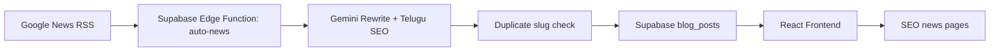

# VarthaNow Telugu AI News

Production-grade React + Supabase + Gemini AI Telugu news platform.

## Stack

- React + TypeScript + Vite
- TailwindCSS
- React Router
- Supabase PostgreSQL
- Supabase Edge Functions + Cron
- Google News RSS feeds
- Google Gemini `gemini-1.5-flash`

## Automated News Flow



## Setup

```bash
npm install
cp .env.example .env
npm run dev
```

Required env:

```bash
VITE_SITE_URL=http://localhost:3000
VITE_SUPABASE_URL=
VITE_SUPABASE_ANON_KEY=
SUPABASE_URL=
SUPABASE_SERVICE_ROLE_KEY=
GEMINI_API_KEY=
```

## Database

Run [supabase/schema.sql](supabase/schema.sql) in Supabase SQL editor. It creates the `blog_posts` table, indexes, public read policy, and admin management policy.

## Edge Function

Deploy:

```bash
supabase functions deploy auto-news
supabase secrets set GEMINI_API_KEY=your-key SUPABASE_URL=your-url SUPABASE_SERVICE_ROLE_KEY=your-service-role
```

Invoke manually:

```bash
supabase functions invoke auto-news
```

## Cron

Run [supabase/cron.sql](supabase/cron.sql) after setting these database settings in Supabase:

```sql
alter database postgres set app.supabase_url = 'https://PROJECT.supabase.co';
alter database postgres set app.supabase_service_role_key = 'SERVICE_ROLE_KEY';
```

The cron schedule runs every 15 minutes.

## SEO

- Dynamic title, description, OG, Twitter card and JSON-LD are generated client-side.
- Static `robots.txt` and `sitemap.xml` live in `public/`.
- Run `npm run sitemap` to regenerate article URLs from Supabase.

## Copyright Safety

The `auto-news` function only uses RSS metadata as input. Gemini rewrites original Telugu summaries, headings, bullet points, FAQs and conclusions. It does not copy full copyrighted articles.
